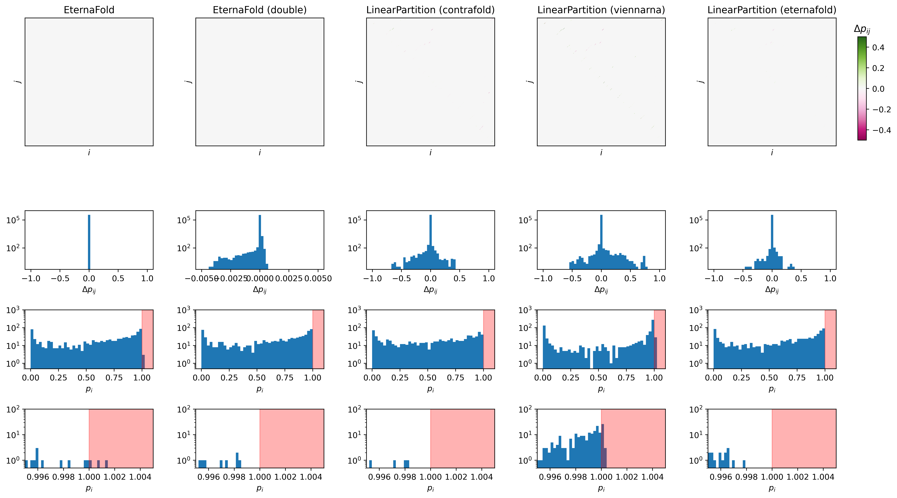

# Corrupted probabilities

This repo is a fork of LinearPartition with the EternaFold [LinearPartition patch](https://github.com/eternagame/EternaFold/blob/master/LinearPartition-E.patch) applied, as described in the [instructions](https://github.com/eternagame/EternaFold/blob/master/README_LinearFold-E_patch.md). Note that this repo was forked from the [latest `b450fb3` commit](https://github.com/LinearFold/LinearPartition/commit/b450fb3e63189073b68d385589035f992080aa3a) of LinearPartition, not from the `ae6507f` commit, because the former commit was still using Python2.

The main goal of these tests is to determine the source of a [bug](https://github.com/eternagame/EternaFold/issues/2), which produces corrupted pairing probabilities $p_i$ that are larger than 1. We used 4 different methods to obtain the pairing probability matrix:

1. EternaFold
2. LinearPartition with default Contrafold parameters
2. LinearPartition with ViennaRNA parameters
2. LinearPartition with EternaFold parameters

We tested a partial MS2 sequence ($L=836$) and randomly generated sequences to determine which methods produce corrupted pairing probabilities.

## Running the tests
1. Clone and compile this LinearPartition fork:
````
git clone https://github.com/domen13/LinearPartition
cd LinearPartition
git checkout eternafold_patch
make
````
2. Clone and compile EternaFold:
````
cd ..
git clone https://github.com/eternagame/EternaFold
cd EternaFold
make
````

3. If needed, change the EternaFold path (`ETERNAFOLDPATH`) in `fold`.
5. Run `python MS2_analysis.py`.
5. Set desired testing parameters in `random_analysis.py` (`num_sequences` and `L`) and run `python random_analysis.py`.


## MS2 results

Results are shown specifically for the two of problematic nucleotides (571 and 572) and also for the whole sequence. Using LinearPartition (either with default Contrafold or with Eternafold parameters) doesn't give corrupted pairing probabilities, while EternaFold and LinearPartition (ViennaRNA parameters) give corrupted probabilities.

````
***** EternaFold *****

  i      j       p_ij
  571    613     0.00438902
  571    616     0.996947
---------------------------
  p_571 = 1.00133602 

  i      j       p_ij
  572    612     0.00449777
  572    615     0.996294
---------------------------
  p_572 = 1.00079177 


Corrupted i:   [571 572 615]
Corrupted p_i:  [1.00133602 1.00079177 1.00002878] 


***** LinearPartition (contrafold) *****

  i      j       p_ij
  571    613     0.006
  571    616     0.99215
---------------------------
  p_571 = 0.99815 

  i      j       p_ij
  572    612     0.00595
  572    615     0.98943
---------------------------
  p_572 = 0.99538 


Corrupted i:   []
Corrupted p_i:  [] 


***** LinearPartition (viennarna) *****

  i      j       p_ij
  571    616     1.0
---------------------------
  p_571 = 1.0 

  i      j       p_ij
  572    615     1.0
---------------------------
  p_572 = 1.0 


Corrupted i:   [ 22  27  57  97 138 141 148 532 536]
Corrupted p_i:  [1.0001  1.00015 1.00015 1.00011 1.00029 1.00022 1.00028 1.00009 1.0002 ] 


***** LinearPartition (eternafold) *****

  i      j       p_ij
  571    613     0.00327
  571    615     0.00011
  571    616     0.99441
---------------------------
  p_571 = 0.9977900000000001 

  i      j       p_ij
  572    612     0.00327
  572    615     0.99329
---------------------------
  p_572 = 0.99656 


Corrupted i:   []
Corrupted p_i:  [] 
````

## Random sequences results

Results show that we weren't able to get corrupted probabilities with either `LinearPartition (c)` or `LinearPartition (e)`, while both `EternaFold` and `LinearPartition (v)` give corrupted probabilities (and their occurrence seems to increase with the sequence length).

### $L=50$
````
Tested 100 sequences with length 50
EternaFold                0 failures
LinearPartition (c)       0 failures
LinearPartition (v)       0 failures
LinearPartition (e)       0 failures
````

### $L=500$
````
Tested 100 sequences with length 500
EternaFold                3 failures
LinearPartition (c)       0 failures
LinearPartition (v)       10 failures
LinearPartition (e)       0 failures
````

### $L=1000$
````
Tested 100 sequences with length 1000
EternaFold                24 failures
LinearPartition (c)       0 failures
LinearPartition (v)       41 failures
LinearPartition (e)       0 failures
````

## Solution

Changing `<float>` to `<double>` in `Contrafold.cpp:121` seems to solve the issue.

````
***** EternaFold (<double>) *****

  i      j       p_ij
  571    613     0.00448648
  571    615     8.47856e-05
  571    616     0.993935
  571    618     1.84115e-05
---------------------------
  p_571 = 0.9985246771 

  i      j       p_ij
  572    612     0.00448534
  572    613     1.95924e-05
  572    615     0.992924
  572    616     1.97649e-05
---------------------------
  p_572 = 0.9974486973000001 


Corrupted i:   []
Corrupted p_i:  [] 
````

### Test on random sequences
````
Tested 100 sequences with length 1000
EternaFold (double)       0 failures
````

### Pairing probability matrix comparison for MS2

Comparison between 5 different methods. $\Delta p_{ij}$ are calculated with respect to EternaFold.


